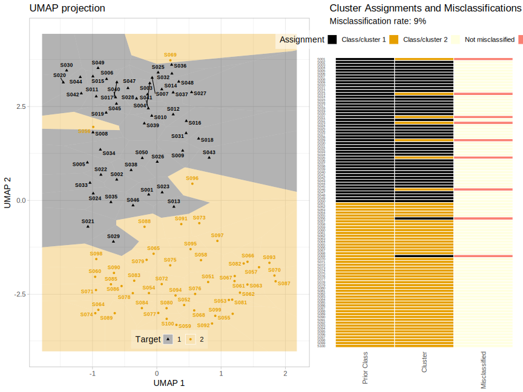

# umap_ward_misclassification_analysis

## Overview

Laboratory errors can produce topically plausible but incorrect results. This package integrates dimensionality reduction (UMAP) with cluster analysis (Ward’s hierarchical clustering) to detect such errors through an intuitive visual framework, enabling researchers to identify problematic samples before they impact downstream analyses.

## Use cases

- Laboratory quality control pipelines
- Multi-omics data validation
- Sample classification verification
- Biomarker discovery studies
- Clinical research quality assurance

## Technical highlights

- ✅ **Comprehensive analysis**: From raw data to final visualizations in a single function  
- 📈 **Detailed outputs**: Includes UMAP coordinates, clusters, visualizations, and a misclassified samples list  
- 🧮 **Statistical rigor**: Uses established UMAP and hierarchical clustering algorithms for robust results  
- 📊 **Publication-ready graphics**: Generates high-quality SVG/PNG outputs for direct use in publications  

---

## Installation

Clone this repository and source the function in your R environment:

---

## Example usage

Below is a complete example of running UMAP-based clustering and checking for misclassifications.

#### Load your data frame: each row is a sample, each column a feature (e.g., lipid species)
```
lipid_profiles <- read.csv("lipid_profiles.csv")
```
#### Load or extract your class labels for each sample
```
sample_metadata <- read.csv("sample_metadata.csv") sample_types <- sample_metadata$SampleType
```
#### Run the integrated UMAP projection and clustering/misclassification analysis
```
results <- umap_ward_misclassification_analysis( data = lipid_profiles, target = sample_types, 
labels = sample_metadata$SampleID, output_dir = "results")
```
#### Output misclassification rate and list which samples were misclassified
```
cat("Sample misclassification rate:", sprintf("%.2f%%", results$misclassification_rate * 100), "\n")
if (!is.null(resultsmisclassified_samples) && nrow(resultsmisclassified_samples) > 0) {
cat("Misclassified samples:\n") print(results$misclassified_samples) } else { cat("No misclassified samples.\n")
}
```
#### Optionally: view UMAP plot object, if provided
```
print(results$umap_plot)
print(results$voronoi_plot)
```


---

## Simulated example data set

This repository includes code to generate a synthetic (arbitrary) example data set resembling lipidomics profiles:

- **lipid_profiles.csv**: Contains 100 samples, each with 8 “lipid” features (Lipid1 to Lipid8). Two classes (“ClassA” and “ClassB”; 50 samples each) are simulated such that each class shows increased values in a subset of features. Noise is added to a few samples to ensure the data can be misclassified by cluster analysis, offering a realistic test scenario.
- **sample_metadata.csv**: Metadata with SampleIDs and their corresponding class label (“SampleType”).  
- The data set is designed so that UMAP dimensionality reduction followed by Ward clustering mostly (but not perfectly) separates the two classes, mimicking real lipidomics experiments.

To generate the example data:

# See create_sample_lipidomics_data.R in the repository for reproducible example data creation.

---

## Function arguments

- `data`: Data frame or matrix of numeric features (samples in rows, features in columns).
- `target`: Vector or factor of true class labels.
- `labels`: (Optional) Row labels for plotting and output (e.g., sample IDs).
- `output_dir`: (Optional) Directory to save SVG/PNG plots and QC outputs.
- `n_neighbors`: *(Optional, default = 15)* Integer; the size of the local neighborhood used by UMAP for manifold approximation. Adjust to control the local/global structure captured in the projection.

---

## Output explanation

- **misclassification_rate**: Fraction of samples assigned to the wrong cluster, compared to ground truth labels.
- **misclassified_samples**: Data frame listing the misclassified samples, their IDs, true labels, and predicted clusters.
- **voronoi_plot**: R `ggplot2` object for the UMAP visualization (can be customized or exported).
- **qc_results directory**: Contains publication-ready SVG/PNG plots and summary tables of clustering results.

---

## Citation

If you use this tool in your work, please cite the repository or contact the maintainer for citation details. <tbd>

---
